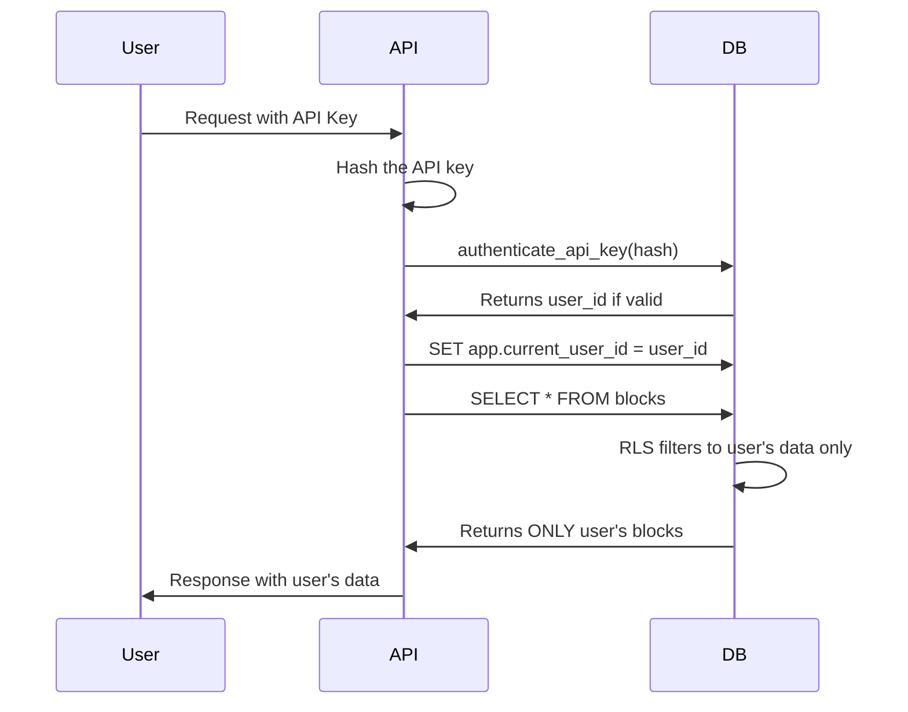

# Catalyst9 Security Architecture

## Multi-Tenant Security with PostgreSQL RLS

Catalyst9 implements true multi-tenant security using PostgreSQL Row-Level Security (RLS), ensuring complete data isolation between users.

## Security Layers

### 1. API Key Security
- **Cryptographically secure** 256-bit keys
- **Unpredictable** - Generated with `secrets.token_bytes(32)`
- **Never stored plain** - Only SHA256 hashes in database
- **Cannot be recovered** - Users must save their keys

Example secure API key:
```
cat9_Pn0CSVnzJXW6WSCo4PO7dPjB0zk92Amq9SmDNVmPFlA
```

**NOT like the old predictable format:**
```
sk-catalyst9-john-2025-001  ❌ ANYONE could guess this!
```

### 2. Database-Level RLS

PostgreSQL enforces access control at the row level:

```sql
-- John can ONLY see John's data
SELECT * FROM blocks;  -- Returns only John's blocks

-- Even if John knows Bert exists and tries:
SELECT * FROM blocks WHERE user_id = 1;  -- Still only returns John's blocks!
```

### 3. Authentication Flow



### 4. RLS Policies

Each table has policies that enforce access:

**Blocks Table:**
- **SELECT**: User's own blocks OR shared blocks
- **INSERT**: Can only create as yourself
- **UPDATE**: Can only modify your own blocks
- **DELETE**: Can only delete your own blocks

**Users Table:**
- **SELECT**: Can see usernames (for sharing)
- **UPDATE**: Can only update your own profile

### 5. Security Features

✅ **Data Isolation** - Users cannot access others' data
✅ **Audit Trail** - All modifications logged
✅ **Key Rotation** - Keys expire after 1 year
✅ **Revocation** - Keys can be revoked immediately
✅ **Rate Limiting** - Per-user limits
✅ **HTTPS Only** - Encrypted transmission

## Attack Scenarios Prevented

### Scenario 1: Guessing API Keys
**Attack:** "I know john uses the system, let me try sk-catalyst9-john-2025-001"
**Prevention:** Keys are 256-bit random, impossible to guess

### Scenario 2: SQL Injection
**Attack:** Trying to access other users' data via SQL injection
**Prevention:** RLS enforced at database level, even raw SQL respects boundaries

### Scenario 3: API Parameter Manipulation
**Attack:** Changing user_id in API requests
**Prevention:** User identity from authenticated session, not request params

### Scenario 4: Stolen Database
**Attack:** Database backup is stolen
**Prevention:** API keys are hashed, cannot be used even if stolen

## Implementation Checklist

- [x] Cryptographically secure API key generation
- [x] SHA256 hashing for storage
- [x] PostgreSQL RLS policies
- [x] Audit logging
- [ ] API middleware for authentication (in progress)
- [ ] Rate limiting per user
- [ ] Key rotation reminders
- [ ] Admin dashboard for key management

## Testing Security

### Test 1: Cross-User Access
```bash
# As John, try to access Bert's data
curl https://catalyst9.ai/api/v1/blocks?user_id=1 \
  -H "Authorization: Bearer {john's key}"
# Result: Still only returns John's blocks
```

### Test 2: Direct Database Access
```sql
-- Even with direct DB access as john
SET app.current_user_id = 2; -- John's ID
SELECT * FROM blocks WHERE user_id = 1; -- Try to get Bert's blocks
-- Result: Empty set (RLS blocks it)
```

### Test 3: Shared Data Access
```sql
-- John can see shared blocks
SELECT * FROM blocks WHERE shared = true;
-- Result: Returns all shared blocks with owner info
```

## Security Best Practices

1. **Never log API keys** - Only log key hashes
2. **Rotate keys annually** - Built-in expiration
3. **Use environment variables** - Never hardcode keys
4. **Monitor failed attempts** - Audit log tracks all access
5. **Principle of least privilege** - Users start with minimal access

## Emergency Procedures

### Compromised API Key
```sql
-- Immediately revoke the key
UPDATE api_keys SET revoked = true WHERE key_hash = '{hash}';
```

### Suspicious Activity
```sql
-- Check audit log
SELECT * FROM audit_log
WHERE user_id = {user_id}
ORDER BY created_at DESC
LIMIT 100;
```

### Lock User Account
```sql
-- Disable user access
UPDATE users SET active = false WHERE username = 'compromised_user';
```

## Compliance

- **Data Isolation**: ✅ Complete user separation
- **Audit Trail**: ✅ All actions logged
- **Encryption**: ✅ HTTPS + hashed credentials
- **Access Control**: ✅ RLS enforced at DB level
- **GDPR Ready**: ✅ User data isolation and deletion

---

**Security is not optional. It's built into the foundation.**